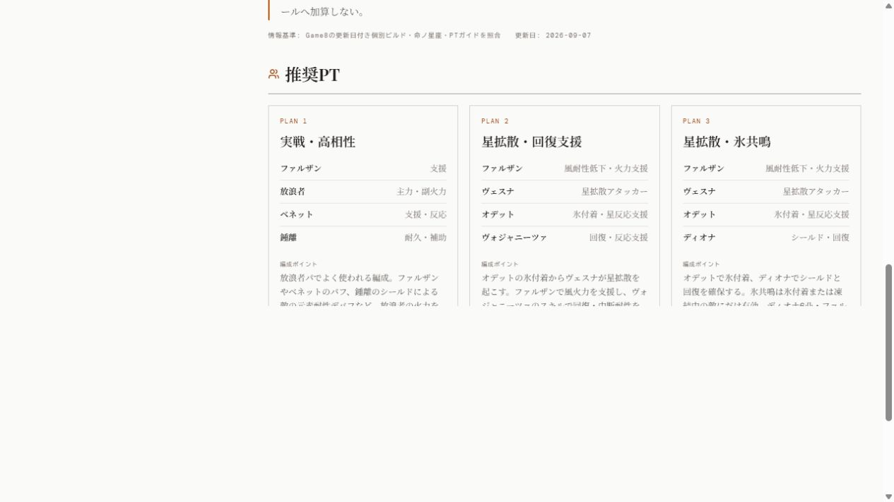

# Phase 52 本番受入結果

- 作成日: 2026-10-03
- 対象アプリ: HoYoverse Builder
- 種別: 実装後メモ
- 対象バージョン: Phase 52（設計 Phase 1・2）
- 検証対象コミット: main `15180742d8ca4b2ad68f3cfd44692db67bcfff0d`（実装PR #98のマージ `00788c2` と文書同期PR #99を含む）
- ステータス: **本番受入 Go（推奨PT・図鑑・更新履歴の移行範囲）**
- 関連: [設計第3版](実装設計書_推奨PTの編成マスタ化と関連キャラ連動_2026-10-01.md)、[最終レビュー](実装レビュー_PR98_Phase52_2026-10-03.md)、[実装ログ](実装ログ.md)

## 1. デプロイ対象の確認

2026-10-03 09:57 JST以降に本番HTTP・ブラウザーで確認。PagesとRailway productionの双方が同じmain `1518074` を配信するデプロイでsuccess。

| 対象 | 証拠 | 結果 |
| --- | --- | --- |
| GitHub Pages | Actions run `37029022147`、deployment `6812291495`。sha `15180742d8ca4b2ad68f3cfd44692db67bcfff0d` | success |
| Railway production | GitHub deployment `6812270398` とRailway deployment `8957f69c-497d-44c6-ac1d-4f6c041f351e`。サービス `hoyoverse-builder-api`、branch main、commitHashはPagesと同一 | SUCCESS、稼働中 |
| 実応答 | API health、Pages OriginのCORS、図鑑・履歴応答、Pages HTMLと参照JS/CSS 2資産 | HTTP 200、health ok、CORS一致 |

healthはリビジョンを返さないため、health単独から配信SHAを推定せず、デプロイのcommitHashと実応答一致を併用した。

## 2. 公開APIの互換性

移行前main `4900c23` から作成して固定していたgolden基準に対し、公開tRPC応答をSuperJSONで復元して深い完全一致を確認。基準の再生成・差分許可は行っていない。

- `build.referenceCatalog`: 全256名のカタログが完全一致。
- `build.guideHistory`: 全256名の個別履歴・サイトイベント・台帳を含む応答全体が完全一致。
- `build.reference`: 原神のヴェスナ、ヴォジャニーツァ、ファルザン、ディオナ、スカーク、フリーナ、エスコフィエ、HSRのパール、ZZZのクラレッタの計9名について、応答全体が完全一致。
- 図鑑応答の比較はPTの編成・表示順・旧表示ID・三言語・役割・条件・出典・日付だけでなく、ビルド・固定目標・凸・元バッチを含む。対象外の247名の個別図鑑応答は今回HTTPで全件取得していない（ローカルgoldenでは全名検証済み）。

## 3. 公開画面の確認

Codexのブラウザーで公開 `/characters` と `/updates` を確認。

- 図鑑は256名、原神111名を表示。
- 原神の新規2名は各2案、関連5名は各3案を表示し、ヴェスナの星拡散2編成とヴォジャニーツァの水氷編成が設計どおり関連キャラからも参照できる。
- 他キャラ起点の共有参照は表示対象の本人が先頭。旧形式の並びは移行前契約のまま。
- ファルザンの既存PLAN 1と追補PLAN 2・3の順序・条件文を確認。共有2案は英語・简体中文への切替後もメンバー名・役割・条件が表示され、日本語へ戻せる。
- `/updates` は256 / 256精査完了と第23バッチのイベントを表示。ファルザンの検索結果に `2026-10-01T19:23:00+09:00` のPT追補と既存第16バッチ履歴が残る。
- 確認した図鑑・更新履歴のブラウザーコンソールerrorは0件。

## 4. 判定と残課題

Phase 52の実装・マージ・本番受入は完了。公開出力不変の契約を満たし、今回の範囲に修正必須の残課題はない。

実UID・外部Enka/MiHoMo経路は今回未検証（新規2名の実UID受入は既存の別ゲート）。全キャラ・全言語・全端末の画面総当たりも未実施。これらを今回の検証成功から推定しない。Phase 3は着手判断待ち、Phase 4のバックログ38件は別バッチ。次は設計に沿って起点キャラ2〜3名単位で共有化する。

本メモの追加は文書と画面証跡のみ。後続の文書反映コミットは今回確認した製品コードを変更しない。
